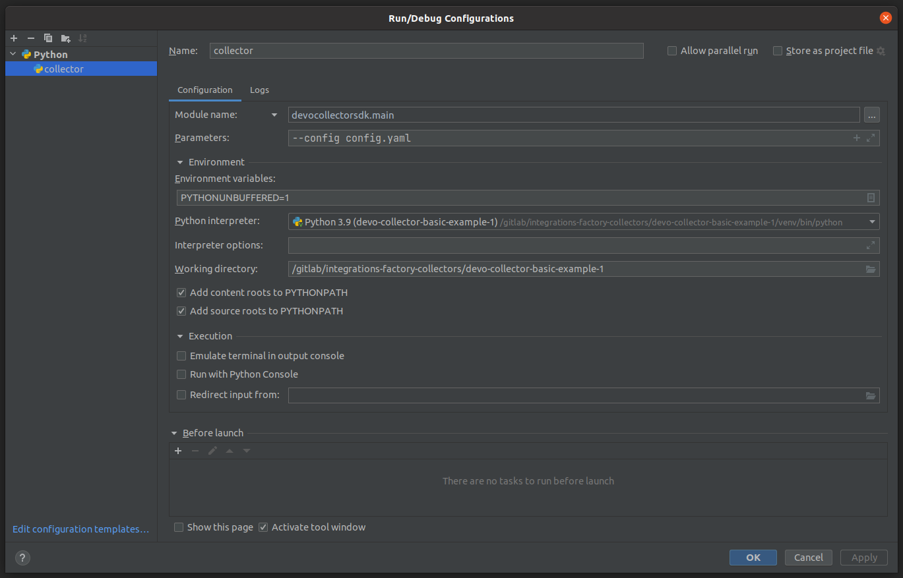

# Intel 471 Malware Intelligence collector for Devo Platform


## Overview

Collects Malware Indicators via Intel 471 TITAN API.

## Vendor Setup
To use this collector, the user must be an existing Intel 471 customer with TITAN API access.
- **Existing customers**
  Please contact <support@intel471.com> to enable API access if not currently enabled
- **New customers**
  Please contact sales at https://intel471.com/company/sales-contact-us

## Minimal Configuration Required
Obtain your API credentials from the API page of TITAN portal. The username will be the email address registered with TITAN and the password is the API key.

## Build and run the collector

### Collector execution during development

Although the final way of executing the data collector is using a Docker container, the data collector can be executed in a local non dockerized environment.

### Using terminal

```
python3 -m devocollectorsdk.main --config <config_filename>.yaml
```

### Using PyCharm

This is a screenshot of a running configuration:



>## **Note**
>
> The required Python package (`devo-collector-sdk==1.7.2`) is not still published in a public repository (the process on going) and, meanwhile this is done, a manual installation has to be done, it can be used the following command:
>
>```script
>pip install ./devo-collector-sdk-1.7.2.tar.gz
>```

---

### Building

The following bash script must be executed from the collector's root directory.

```bash
./build_tools/build_docker.sh
```

### Running as a Docker container

Change `<version>` to current version of the collector. (*Current version is* `1.0.0`)
```bash
docker run \
--name intel471-collector \
--volume $PWD/certs:/devo-collector/certs \
--volume $PWD/config:/devo-collector/config \
--volume $PWD/credentials:/devo-collector/credentials \
--volume $PWD/state:/devo-collector/state \
--env CONFIG_FILE=config.yaml \
--rm --interactive --tty \
devo.com/collectors/intel471:<version>
```

## Vulnerabilities check with Trivy

The security vulnerabilities can be checked using the Trivy software (https://trivy.dev/)

### Local installation

Change `<version>` to current version of the collector.
```bash
trivy image --severity CRITICAL,HIGH,UNKNOWN path_to_collector_image:<version>
```

### Docker

Change `<version>` to current version of the collector.
```bash
docker run aquasec/trivy image --severity CRITICAL,HIGH,UNKNOWN devo.com/collectors/intel471:<version>
```
